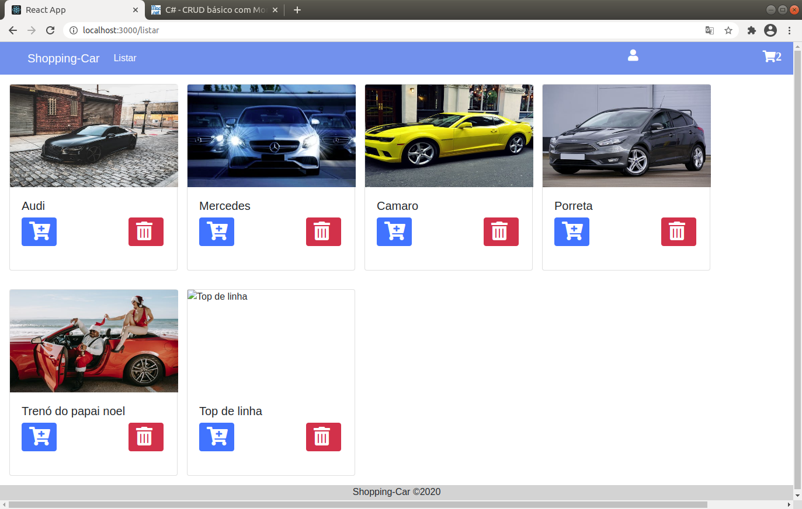
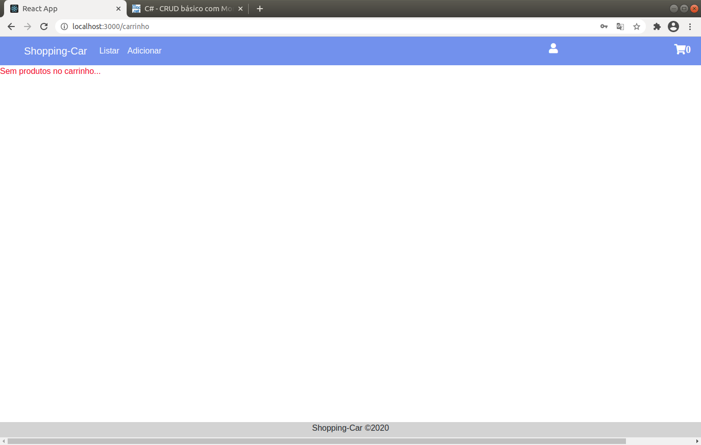
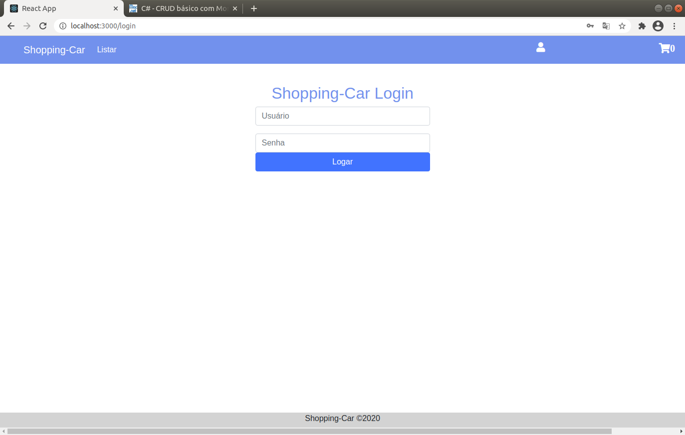

# E-commerce-Carros-React-Js

## Preview

   
    
     

 

## Sobre o E-commerce-Carros

É um site simples de compra de carros, onde você pode Adicionar uma URL(imagem) e um nome pra ele e adiciona a página de listar, onde estará disponivel para 'comprar', mas veja bem, você somente poderá adicionar se estiver logado.

Muito aprendizado colocado em prática, Redux-js, ReduxJs/toolkit, site simples e com muito conteúdo, aprendi a criar e manipular banco de dados(mongodb), criei uma Api e consumi seus dados para a página de carros, criei um carrinho de compras funcional, coloquei em prática um pouco sobre autenticação e rotas privadas.

## Installation

Clone o Repositório com `git clone com https://github.com/Leojunkes/e-commerce-leo `.

`cd e-commerce-leo`
`npm start ou yarn start`

## License

This project is licensed under the MIT License - see the LICENSE.md file for details.
